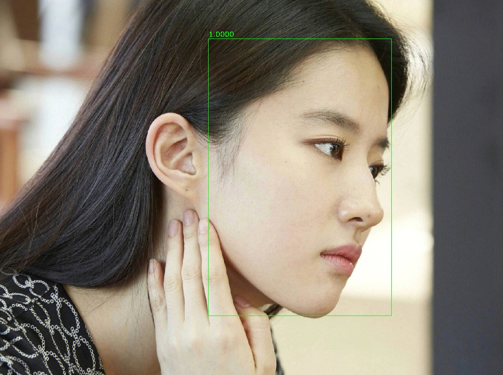
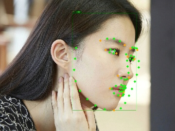
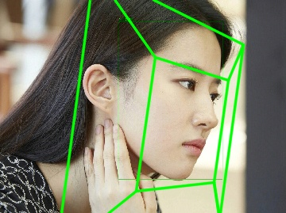
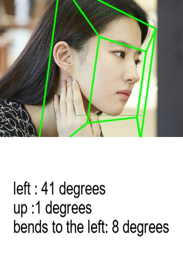
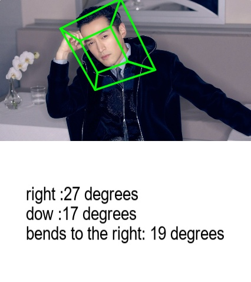

# Head-posture-detection-dlib-opencv-

头部姿态检测（dlib+opencv）Demo

---
title: 基于OpenCV 和 Dlib 进行头部姿态估计

---

**<font color="009688"> 庐山烟雨浙江潮，未到千般恨不消。到得还来别无事，庐山烟雨浙江潮。----《庐山烟雨浙江潮》苏轼**</font>


<!-- more -->
## 写在前面

***
+ 工作中遇到，简单整理
+ 理解不足小伙伴帮忙指正


**<font color="009688"> 庐山烟雨浙江潮，未到千般恨不消。到得还来别无事，庐山烟雨浙江潮。 ----《庐山烟雨浙江潮》苏轼**</font>

***


实验项目以上传，只需 git 克隆，就可以开始使用了，但是需要说明的是 Dlib 的基于 `HOG特征和SVM分类器`的人脸检测器很一般，很多脸都检测不到，实际情况中可以考虑使用深度学习模型来做关键点检测，然后评估姿态。可以查看文章末尾大佬的开源项目


### 实现效果

|Demo|
|--|
|原图|
||
||
|特征点标记后|
||
|姿态标记|
||
|姿态对应的Yaw，Pitch，Roll 度数|
||
||

### 步骤

三个主要步骤：

#### 人脸检测

`人脸检测`：引入人脸检测器 `dlib.get_frontal_face_detector()` 以检测包含人脸的图片，多个人脸会选择面积最大的人脸。

`dlib.get_frontal_face_detector()` 是 `dlib` 库中的一个函数，用于获取一个基于`HOG特征和SVM分类器`的人脸检测器。该函数返回一个可以用于检测图像中人脸的对象。

具体来说，HOG（Histogram of Oriented Gradients，梯度方向直方图）是一种常用于图像识别中的特征描述子，SVM（Support Vector Machine，支持向量机）是一种常用的分类器。将HOG特征与SVM分类器结合起来，可以得到一个有效的人脸检测器。

在使用 `dlib.get_frontal_face_detector()`函数时，只需将待检测的图像作为参数传入，即可得到一个用于检测人脸的对象。一个Demo
```py
import dlib
import cv2

# 读取图像
img = cv2.imread('image.jpg')

# 获取人脸检测器
detector = dlib.get_frontal_face_detector()

# 在图像中检测人脸
faces = detector(img)

# 输出检测到的人脸数
print("检测到的人脸数为：", len(faces))

```

#### 面部特征点检测

`面部特征点检测`，利用预训练模型 `shape_predictor_68_face_landmarks.dat` 以人脸图像为输入，输出`68个人脸特征点`。

`shape_predictor_68_face_landmarks.dat` 是基于 dlib 库中的人脸特征点检测模型，该模型使用了基于 HOG 特征和 SVM 分类器的人脸检测器来检测图像中的人脸，并使用回归算法来预测人脸的 68 个关键点位置。这些关键点包括眼睛、鼻子、嘴巴等部位，可以用于进行人脸识别、表情识别、姿态估计等应用。

这个模型文件可以在dlib的官方网站上下载。在使用它之前，需要安装dlib库并将模型文件加载到程序中。

```py
predictor = dlib.shape_predictor(r".\shape_predictor_68_face_landmarks.dat")
```
#### 姿势估计

姿势估计。在获得 68 个面部特征点后，选择部分特征点，通过 `PnP`算法计算姿势 `Yaw、Pitch、Roll` 度数

```py
    (success, rotation_vector, translation_vector) = cv2.solvePnP(model_points, image_points, camera_matrix,
                                                                  dist_coeffs, flags=cv2.SOLVEPNP_ITERATIVE)
```


`Yaw、Pitch、Roll` 是用于描述物体或相机在三维空间中的旋转角度的术语，常用于`姿态估计和姿态控制`中。

+ `Yaw(左右)`：绕垂直于物体或相机的轴旋转的角度，也称为偏航角。通常以 z 轴为轴进行旋转，正值表示逆时针旋转，负值表示顺时针旋转。
+ `Pitch(上下)`：绕物体或相机的横轴旋转的角度，也称为俯仰角。通常以 x 轴为轴进行旋转，正值表示向上旋转，负值表示向下旋转。
+ `Roll(弯曲)`：绕物体或相机的纵轴旋转的角度，也称为翻滚角。通常以 y 轴为轴进行旋转，正值表示向右旋转，负值表示向左旋转。

这三个角度通常以欧拉角的形式表示，可以用于描述物体或相机的姿态信息。在计算机视觉中，常用于人脸识别、动作捕捉、机器人控制等应用场景。


## 博文部分内容参考

© 文中涉及参考链接内容版权归原作者所有，如有侵权请告知，这是一个开源项目，如果你认可它，不要吝啬星星哦 :)


***
https://blog.csdn.net/zhang2gongzi/article/details/124520896

https://github.com/JuneoXIE/

https://github.com/yinguobing/head-pose-estimation

***

© 2018-2023 liruilonger@gmail.com, All rights reserved. 保持署名-非商用-相同方式共享(CC BY-NC-SA 4.0)
